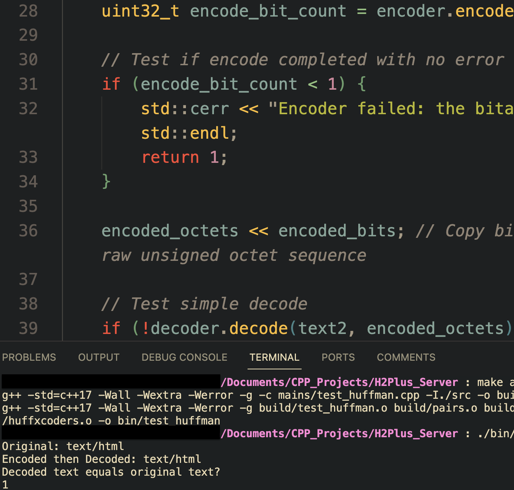

# README

### Brief
A simple HTTP/2 cleartext server made with C++. The purpose of this project is to help myself learn more about the web, its HTTP protocol, and review C++. I do not intend this to be production ready at all and this will take some time to get working.

### WIP Screenshots

### Notes
 - Ensure that the `openssl` library headers are installed on the your system.
 - Windows is unsupported because of the GNU Makefile.
 - Create the bin and build folder at the project root for the build to work.
 - Files in mains with names such as `test_*` are the unit tests.

### Todos
 1. ~~Make special collections: BitArray, Prefix BT~~
 2. ~~HPACK Huffman encoder & decoder.~~
 3. ~~HPACK header indexing table (static, dynamic).~~
 4. ~~HPACK string and integer encoder & decoder.~~
 5. Make HPACK context class.
    - Make unit tests with mock headers. See RFC 7541 5.2 for how the Huffman flag is put by the string length.
 6. Make HTTP/2 streams and other utils.
   - Make `Http2Stream`.
   - Consider stream priority tree and algorithm...
   - Make HTTP/2 `FrameScanner` and `FrameWriter`.
   - Make `Http2Connection`.
 7. Create server workers.
 8. Create server driver.
 9. Put together thread pool implementation.
 10. Finish up driver class of server.
 11. Test with cURL.

### Other Notes:
 - Use the [OpenSSL](https://www.openssl.org/docs/man3.0/man7/ssl.html) library headers:
  - `openssl/ssl.h` for secure sockets
  - `openssl/x509.h` for certificate loading
